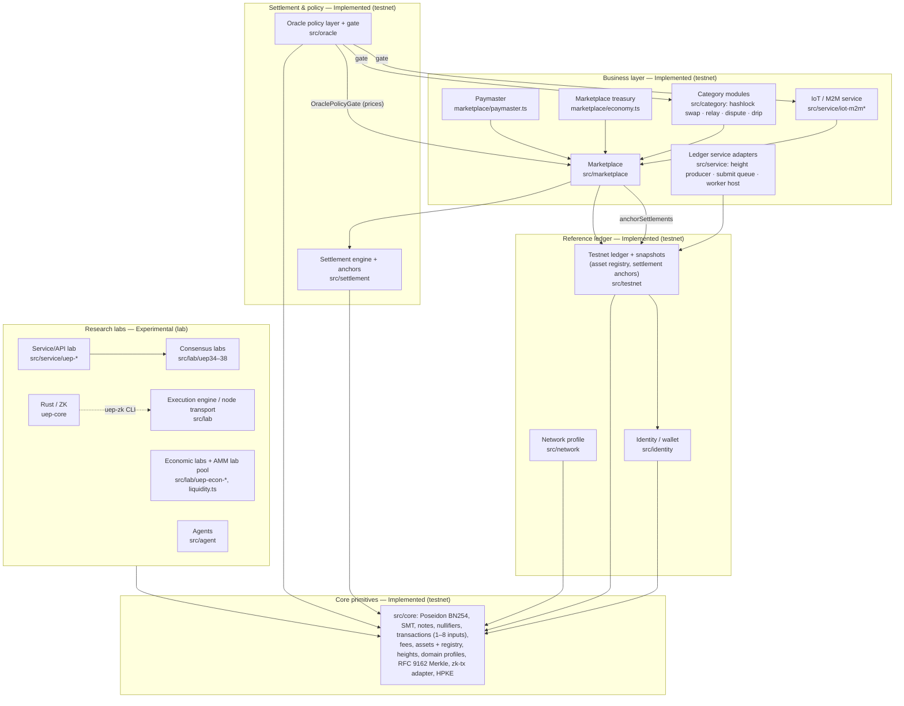

# UEP modules

> Module map of the repository at v0.5.3 (on `main`; Latest GitHub Release: v0.5.3).
> Status labels follow the README legend: **Implemented (testnet)** = local,
> single-node, in-process testnet only; **Experimental (lab)**; **Planned**; **Research**.
> Nothing in this repository is a live network or a production system. There is no
> native token and no common currency. External reviews of later versions have taken
> place; their reports are not yet published in this repository and will be added (with
> version and remediation status) as they are incorporated. The last externally reviewed
> threshold with a published report in this repository is v0.4.6 (see
> [`SECURITY-COVERAGE.md`](./SECURITY-COVERAGE.md) and
> [`REMEDIATION-COVERAGE-v0.4.7-v0.5.x.md`](./REMEDIATION-COVERAGE-v0.4.7-v0.5.x.md)).

## Module map

Arrows mean "imports / depends on" (read from the `import` statements of non-test
files). The oracle layer is never imported from `src/core` or `src/testnet`; the
ledger verifies anchored settlement receipts itself and never calls the Marketplace.

## Modules at a glance

| # | Module | Path | Status | Since | Tests |
|---|---|---|---|---|---|
| 1 | Core primitives | `src/core` | Implemented (testnet) | 0.3.0 | `test:protocol` |
| 2 | Testnet ledger + snapshots | `src/testnet` | Implemented (testnet) | 0.3.0 | `test:protocol`, `check:snapshot-compat` |
| 3 | Identity / wallet | `src/identity` | Implemented (testnet) | 0.3.0 | `test:protocol` |
| 4 | Network profile | `src/network` | Implemented (testnet) | 0.3.0 | `test:protocol` (indirect) |
| 5 | Protocol vs. Marketplace treasury | concept | Implemented (testnet) | 0.3.0 | `test:protocol`, `test:marketplace` |
| 6 | Marketplace | `src/marketplace` | Implemented (testnet) | 0.3.0 | `test:marketplace` |
| 7 | Paymaster | `src/marketplace/paymaster.ts` | Implemented (testnet) | 0.3.0 | `test:marketplace` |
| 8 | Settlement engine + ledger anchors | `src/settlement` | Implemented (testnet) | 0.5.2 (anchors 0.5.3) | `test:settlement` |
| 9 | Hashlock swap / relay / dispute / drip | `src/category` | Implemented (testnet) | 0.5.2 | `test:category` |
| 10 | Oracle policy layer + gate | `src/oracle` | Implemented (testnet) | 0.5.2 (gate 0.5.3) | `test:oracle` |
| 11 | IoT / M2M | `src/service/iot-m2m*` | Implemented (testnet) | 0.4.0 | `test:marketplace` |
| 12 | Service/API lab | `src/service/uep-*`, adapters | Experimental (lab) | 0.5.0 | `test:lab` |
| 13 | Economic labs, AMM lab pool | `src/lab/uep-econ-*`, `src/lab/liquidity.ts` | Experimental (lab) | 0.5.0 | `test:lab` |
| 14 | Consensus / node labs | `src/lab` | Experimental (lab) | 0.5.0 | `test:lab`, `test:lab:known` |
| 15 | Agents | `src/agent` | Experimental (lab) | 0.5.0 | `test:lab` |
| 16 | Rust / ZK | `uep-core` | Experimental (lab) | 0.5.0 | `test:rust`, `build:uep-zk` |
| 17 | Ledger service adapters (height producer, submit queue, worker host) | `src/service/height-producer.ts`, `ledger-submit-queue.ts`, `ledger-worker-host.ts` | Implemented (testnet) | 0.5.1 (queue, worker 0.5.3) | `test:marketplace` |

---

## 1. Core primitives (`src/core`)
- **Purpose:** primitives shared by every other module: Poseidon BN254 hash, field arithmetic, sparse Merkle tree (compressed since v0.5.0), notes, nullifiers, transactions (single- and multi-input since v0.5.3), fee rule, asset ids and the signed asset registry manifest, Ed25519, block height, domain profiles, RFC 9162 Merkle tree (inclusion and, since v0.5.3, consistency proofs), the zk-tx adapter (v0.5.3), the height authority (v0.5.3) and HPKE (RFC 9180 base mode, X25519 / HKDF-SHA256 / ChaCha20-Poly1305, node:crypto, v0.5.3; used to seal relay payloads end to end).
- **Status:** Implemented (testnet).
- **Introduced:** v0.3.0; Poseidon protocol hash v0.5.0; heights and domain profiles v0.5.1; RFC 9162 Merkle v0.5.2; multi-input, consistency proofs, zk-tx adapter, HPKE v0.5.3.
- **Tests:** `npm run test:protocol` (includes `src/core/*.test.ts` and the RFC test vectors in `crypto-vectors.test.ts`); `npm run lint:determinism`.
- **Depends on:** nothing outside `src/core`.

## 2. Testnet reference ledger (`src/testnet`)
- **Purpose:** deterministic, local, in-process state machine: accounts, multi-asset balances, signed spends with 1–8 input notes, nullifier replay protection, protocol fee (0.1 %, min. 1 unit) into the protocol treasury, snapshots with chained migrations (format 9). Since v0.5.3: optional signed asset registry (unknown / deprecated assets refused, registry hash in the snapshot), settlement anchors (Marketplace receipts verified and hash-chained into ledger state), O(1) txId / committed-nullifier indexes for the replay checks (rebuilt on restore) and the height authority (only a running height producer advances the height).
- **Status:** Implemented (testnet), single node, in-process.
- **Introduced:** v0.3.0; per-asset isolation v0.4.7; snapshot migration chain v0.5.1; registry, anchors and multi-input v0.5.3.
- **Tests:** `npm run test:protocol`, `npm run check:snapshot-compat`, `npm run smoke:testnet`, `npm run quickstart`.
- **Depends on:** core, identity, network, settlement (anchor verification, pure functions).

## 3. Identity / wallet (`src/identity`)
- **Purpose:** BIP-39 mnemonics, key derivation and a local vault for test credentials.
- **Status:** Implemented (testnet). Test seeds have no value.
- **Introduced:** v0.3.0 (identity primitives).
- **Tests:** `npm run test:protocol`.
- **Depends on:** core.

## 4. Network profile (`src/network`)
- **Purpose:** the public TESTNET profile (network id, genesis hash, assets, reference block time). Global and interplanetary profiles are not public endpoints.
- **Status:** Implemented (testnet).
- **Tests:** covered by the protocol tests.
- **Depends on:** core.

## 5. Protocol treasury vs. Marketplace treasury (concept)
Not a separate code module; two distinct accounting concepts:
- **Protocol treasury** — receives the 0.1 % protocol fee in `src/testnet/ledger.ts`.
- **Marketplace treasury** — `src/marketplace/economy.ts`: the 3 % Marketplace fee split into OPERATIONS 40 %, RISK_RESERVE 25 %, PRODUCT_DEVELOPMENT 20 %, DISTRIBUTABLE_PROFIT 15 % (code names). RISK_RESERVE also receives the treasury share of slashed / forfeited bonds; DISTRIBUTABLE_PROFIT funds the drip budget for nodes. See [`ECONOMIC-MODEL.md`](./ECONOMIC-MODEL.md).
- Neither is a token treasury, and neither gives anyone a claim.

## 6. Marketplace (`src/marketplace`)
- **Purpose:** service listings, capacity, orders, HOLD / reservation lifecycle, delivery hashing, reputation, signed order actions, buyer disputes with arbiters and timeout outcome; signed snapshot / restore of the full Marketplace state (format 4, v0.5.3: balances, holds, orders, bonds, treasury, paymaster, idempotency records; `marketplace-state.ts`); height-based retention of closed orders and expiring idempotency records (v0.5.3); optional oracle reference prices on listings (v0.5.3).
- **Status:** Implemented (testnet). Not an end-to-end transaction through the consensus / ZK stack.
- **Introduced:** v0.3.0; signed actions and disputes v0.4.4; settlement through the engine v0.5.2; snapshot, anchors and oracle gate v0.5.3.
- **Tests:** `npm run test:marketplace`, `npm run simulate:20k`.
- **Depends on:** core, settlement, oracle (gate, optional), service (content hash), network, testnet, identity.

## 7. Paymaster (`src/marketplace/paymaster.ts`)
- **Purpose:** gas-sponsorship accounting for Marketplace orders; reservations expire and are capped (v0.5.0); sponsorship is held and captured only on settlement (v0.5.2).
- **Status:** Implemented (testnet), accounting only.
- **Tests:** `src/marketplace/paymaster-reserve.test.ts` (in `test:marketplace`).

## 8. Settlement engine and ledger anchors (`src/settlement`)
- **Purpose:** single payout executor behind Marketplace `payout()` and category `settleHold()`; plans, then commits, checking `escrow = providerNet + fee + gas + buyerRefund`. Receipts are canonically hashed (v2 binds the `networkId`; v1 receipts still verify through a versioned alias) and batched in an RFC 9162 Merkle tree. Since v0.5.3 the ledger anchors receipt batches into consensus state (`anchorSettlements`), and the cumulative receipt log has RFC 9162 consistency proofs.
- **Status:** Implemented (testnet).
- **Introduced:** v0.5.2; anchors, receipt v2 and consistency proofs v0.5.3.
- **Tests:** `npm run test:settlement`. See [`SETTLEMENT.md`](./SETTLEMENT.md) and [`SETTLEMENT-BRIDGE.md`](./SETTLEMENT-BRIDGE.md).
- **Depends on:** core, Marketplace (types).

## 9. Category modules (`src/category`)
All four run on once-issued escrow / subsidy ports from the Marketplace and hold no private ledgers. Commitments use SHA-256 (see the residual limits in [`CATEGORY-MODULES.md`](./CATEGORY-MODULES.md)). Status: **Implemented (testnet)**, since v0.5.2, hardened in v0.5.3, tests `npm run test:category`.

### 9.1 Hashlock swap (`swap.ts`)
Bilateral cross-asset hashlock settlement between two identities. Not an AMM and not a DEX. Optional oracle price check for governed pairs (v0.5.3). Distinct from the **AMM lab pool** (§13).
### 9.2 Relay (`relay.ts`, `relay-crypto.ts`)
Paid data relay with chunk fraud proofs; once the committed key is published, 20 % custody / 80 % delivery split. v0.5.3: a wrong or missing key costs the provider 20 % of the bond (paid to the buyer); a dispute timeout after the key resumes the order instead of refunding the buyer.
### 9.3 Dispute / arbiters (`dispute.ts`, `disputable.ts`)
k-of-n arbiter quorum with bonds (per-asset minimum since v0.5.3); timeout outcome per category; timeout compensates the respondent with 20 % of the claimant's bond. No appeal, staking or arbiter rotation.
### 9.4 Drip (`drip.ts`, `settlement-index.ts`)
Subsidy claims bound to the settlement index written by swap / relay; at most 50 % of an order's Marketplace fee, once per order, from DISTRIBUTABLE_PROFIT within an administrator-signed budget.

## 10. Oracle policy layer (`src/oracle`)
- **Purpose:** signed, height-bounded observations (domain-separated with the `networkId` since v0.5.3) aggregated with per-key weight caps. `OraclePolicyGate` (v0.5.3) checks Marketplace listing prices, IoT tariffs and hashlock-swap rates against a reference band and fails closed. Never holds balances; not on the spend or consensus path. FX reference rates are display-only.
- **Status:** Implemented (testnet). Sources are configured keys; no on-network oracle consensus.
- **Introduced:** v0.5.2; hardening and gate v0.5.3.
- **Tests:** `npm run test:oracle`. See [`ORACLE.md`](./ORACLE.md).
- **Depends on:** core only (the gate is consumed by Marketplace, IoT and swap).

## 11. IoT / M2M service (`src/service/iot-m2m*.ts`)
- **Purpose:** signed machine-to-machine flows (telemetry, metering) settled through the Marketplace, with domain delay windows (e.g. the Mars profile adds a fixed delay computed offline). Optional oracle tariff check (v0.5.3).
- **Status:** Implemented (testnet). No hardware attestation.
- **Introduced:** v0.4.0; domain delay windows v0.5.1.
- **Tests:** `npm run test:marketplace` (`iot-m2m.test.ts`, `iot-mars-delay.test.ts`).
- **Depends on:** Marketplace, core, oracle (gate, optional).

## 12. Service/API lab (`src/service/uep-*.ts`, storage adapters, `groth16-spend-queue.ts`)
- **Purpose:** versioned HTTP service API, storage abstraction (memory / S3 / IPFS adapters), observability, Groth16 spend queue.
- **Status:** Experimental (lab). The HTTP authorization tests (`uep-http-authz.test.ts`) run in `test:marketplace`.
- **Layout note (v0.5.3 decision):** `src/service` mixes the Implemented IoT layer with lab files (`groth16-spend-queue.ts` imports six lab modules). Moving the lab files would change import paths used by tests and external experiments; it was **not** done in v0.5.3 because it needs shims for every moved path. The status of each file is listed in [`src/service/README.md`](../src/service/README.md).

## 13. Economic labs and AMM lab pool (`src/lab/uep-econ-*`, `src/lab/liquidity.ts`)
- **Purpose:** simulations of service settlement, escrow and dispute liveness; a constant-function **AMM lab pool** with its own simulated 0.3 % pool fee that the testnet never charges and that never moves testnet ledger value.
- **Status:** Experimental (lab).
- **Tests:** `npm run test:lab -- econ`, `npm run test:lab -- liquidity`.

## 14. Consensus and node labs (`src/lab/uep34-*` … `uep38-*`, `node-*.ts`, `execution-engine.ts`, `uep-net-adapt/`)
- **Purpose:** leader election, quorum and commit certificates, BFT gate, DAG dissemination, partitions and recovery, multi-leader aggregates, view change, authenticated TCP transport, parallel execution engine, delay-tolerant bridging (simulation).
- **Status:** Experimental (lab). Local, in-process or local multi-process only; not a network.
- **Tests:** `npm run test:lab` (blocking in CI); the files in `scripts/lab-known-issues.json` run with `npm run test:lab:known` (non-blocking).

## 15. Agents (`src/agent`)
- **Purpose:** agent identity, owner-signed capability certificates, signed action requests, nonce windows.
- **Status:** Experimental (lab).
- **Tests:** `npm run test:lab -- agent` (`agent-foundation.test.ts`, `agent-integration-hardening.test.ts`).
- **Depends on:** nothing outside the folder (no relative imports).

## 16. Rust / ZK core (`uep-core/`)
- **Purpose:** Poseidon BN254 + R1CS gadget (`uep-21-poseidon`), state-transition and atomic scaffolds (`uep-23`, `uep-24`, built and tested since v0.5.3), UEP-25 reference state machine, UEP-26 Groth16 spend circuit and `uep-zk` CLI.
- **Status:** Experimental (lab). Development keys only (refused under `NODE_ENV=production`); no setup ceremony.
- **Tests:** `npm run test:rust`, `npm run build:uep-zk`.
- **What remains for alignment with the core:** see [`LABS.md`](./LABS.md) point 7.

## 17. Ledger service adapters (`src/service/height-producer.ts`, `ledger-submit-queue.ts`, `ledger-worker-host.ts`)
- **Purpose:** node tooling around the ledger, outside the transitions. `HeightProducer` turns monotonic real time into heights (5 s minimum block spacing, at most 12 blocks per tick) and, since v0.5.3, holds the ledger's height authority while it runs. `LedgerSubmitQueue` (v0.5.3) is a bounded FIFO with queue-wait timeout and backpressure (`LEDGER_BUSY` with `retryAfterSeconds`; HTTP 503 + `Retry-After` on `POST /v1/ledger/transactions`). `LedgerWorkerHost` (v0.5.3) runs the ledger on a `node:worker_threads` worker so Poseidon / SMT work does not block the service event loop ([`PERFORMANCE.md`](./PERFORMANCE.md)).
- **Status:** Implemented (testnet).
- **Introduced:** v0.5.1 (height producer); v0.5.3 (height authority, submit queue, worker host).
- **Tests:** `height-producer.test.ts`, `ledger-submit-queue.test.ts`, `ledger-worker-host.test.ts` (in `test:marketplace`).
- **Depends on:** testnet, core.

## 18. Planned / research
- **Planned:** IoT multi-attester evidence; binding relay recipient X25519 keys to Marketplace identities (HPKE sealing itself is in v0.5.3); arbiter appeal / stake; circuit-friendly account ids (see [`ROADMAP.md`](../ROADMAP.md)).
- **Research:** multi-node public network, delay-tolerant and interplanetary settlement. Nothing operational.
